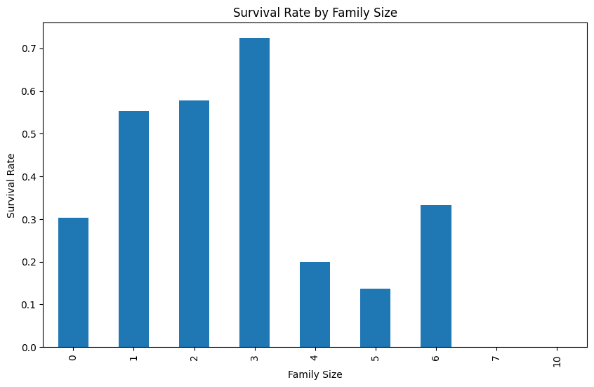

## Claude Pandas Agent (CPA)

This is a demo of an "AI" agent using Anthropic's tool calling and the 
PANDAS python library. The agent can run arbitrary PANDAS Dataframe operations
(based on the assumed inherent PANDAS knowledge that Claude has) on data
stored in a stack and register. 

This is experimental and limited, but does pretty well for something
so basic.

The basic loop is to call pandas functions on a data set and then look at the 
output to decide what to do next. Importantly, this includes generting
figures and analyzing them using Claude's vision functionality, so we can
make charts and then describe them, which is cool.

All of the "tools" the agent needs are defined as pydantic models in cpa.py

These are:

```python
class DataFrameOperation(BaseModel):
    """Call a member function of a Pandas DataFrame in the "stack"."""

class SeriesOperation(BaseModel):
    """Call a member function of a Pandas Series in the series register.""" 

class Pop(BaseModel):
    """Pop the top DataFrame from the stack."""

class SeriesAssign(BaseModel):
    """Assign the series in the series register to the dataframe at the top of the stack."""

The LLM is prompted to make a decision of what tool to use at each step. A full
 demo, with the output in the linked [demo.ipynb](demo.ipynb) is below. Note 
that an Anthropic API key is necessary for it to work and must be added
to the environment with `export ANTHROPIC_API_KEY=<your key>`

```python
from cpa import init, step

request = "Analyze the relationship between family size (SibSp + Parch) and survival rate, including a visualization of your findings."
csv_file = "data/titanic.csv"
state = init(request,csv_file)

while state.tool_call:
    step(state)
```

### Output
```
while state.tool_call:
    step(state)

To analyze the relationship between family size and survival rate, including a visualization, we'll need to perform a few steps. Let's start by creating a new column for family size and then calculate the survival rate based on family size.

1. First, let's create a new column for family size:
dataframe_operation
{'target_frame': 0, 'function': 'eval', 'kwargs': {'expr': 'SibSp + Parch'}}

...
[steps omitted]
...
Now that we have the survival rates for each family size, let's create a bar plot to visualize this relationship:
series_operation
{'function': 'plot.bar', 'kwargs': {'figsize': [10, 6], 'title': 'Survival Rate by Family Size', 'xlabel': 'Family Size', 'ylabel': 'Survival Rate'}}



Based on the analysis of the relationship between family size and survival rate on the Titanic, we can draw the following conclusions:

1. Family size distribution:
   - The dataset includes family sizes ranging from 0 (traveling alone) to 10.
   - Most passengers had family sizes between 0 and 3.

2. Survival rates:
   - Passengers traveling alone (family size 0) had a survival rate of about 30.4%.
   - Passengers with a family size of 1-3 had higher survival rates:
     * Family size 1: 55.3% survival rate
     * Family size 2: 57.8% survival rate
     * Family size 3: 72.4% survival rate (highest survival rate)
   - Survival rates generally decreased for larger family sizes:
     * Family size 4: 20.0% survival rate
     * Family size 5: 13.6% survival rate
   - There were some exceptions for very large family sizes, but these might be due to small sample sizes:
     * Family size 6: 33.3% survival rate
     * Family size 7 and 10: 0% survival rate (likely very few passengers in these categories)

3. Key observations:
   - Passengers with small to medium-sized families (1-3 members) had the highest survival rates.
   - The optimal family size for survival appears to be 3, with a 72.4% survival rate.
   - Traveling alone was associated with a lower survival rate compared to having a small family.
   - Very large families (5 or more members) generally had lower survival rates, possibly due to difficulties in keeping the entire family together during the emergency or limited resources for large groups.

4. Possible explanations:
   - Small families might have been better able to stay together and help each other during the disaster.
   - Passengers with families might have had higher priority for lifeboats, especially women and children.
   - Very large families might have faced challenges in coordinating their evacuation or securing spots on lifeboats for all members.

5. Limitations:
   - The analysis doesn't account for other factors that might influence survival, such as passenger class, age, or gender.
   - Some family size categories (especially larger ones) might have small sample sizes, making their survival rates less reliable.

In conclusion, there is a clear relationship between family size and survival rate on the Titanic. Passengers traveling with small families (1-3 members) had the highest chances of survival, with those in a family of three having the best odds. This information could be valuable for understanding the dynamics of survival in maritime disasters and could potentially inform emergency protocols for future passenger ships.
```


